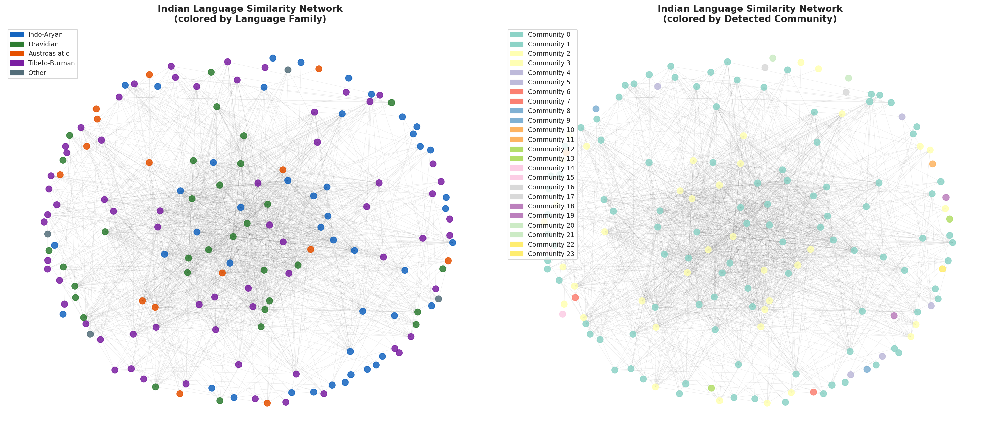
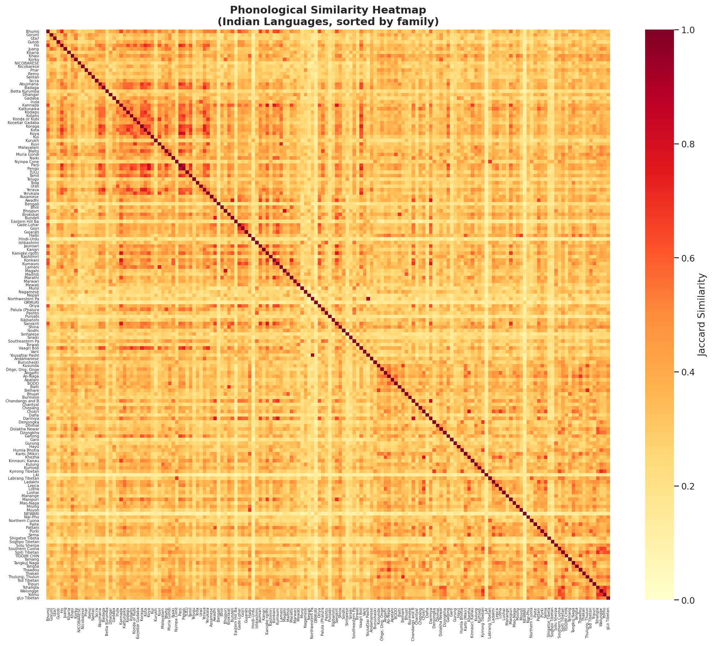
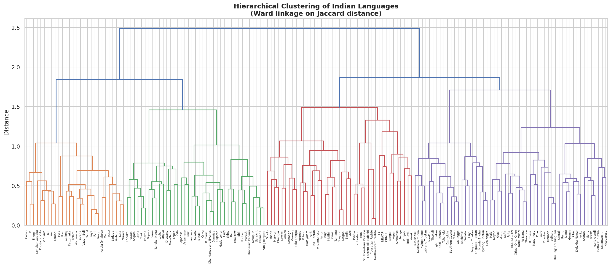
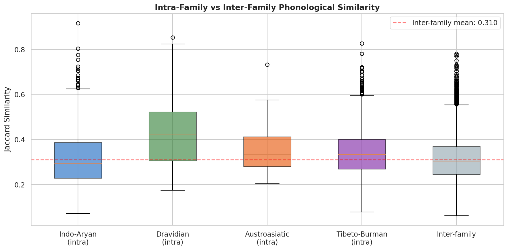

# Indian Language Similarity Network
### A Phonological Network Analysis of 162 Indian Languages

---

## Overview

This project builds a **phonological similarity network** of Indian languages using the PHOIBLE 2.0 database. It computes pairwise Jaccard similarity between phoneme inventories, constructs a network graph, performs community detection, and evaluates whether computational clusters align with established language families.

**Key Question:** *Do languages from the same family (Indo-Aryan, Dravidian, Austroasiatic, Tibeto-Burman) cluster together based purely on their sound inventories?*

**Answer:** Yes — with high statistical significance (Mann-Whitney U, p < 0.000001).

---

## Key Results

| Metric | Value |
|--------|-------|
| Indian languages analyzed | 162 |
| Unique phonemes | 610 |
| Language families | 5 |
| Network nodes | 162 |
| Network edges | 1,385 |
| Network density | 0.106 |
| Communities detected | 24 |
| Modularity | 0.353 |
| Mean pairwise similarity | 0.320 |
| Max similarity | 0.917 |

### Intra-Family vs Inter-Family Similarity

| Family | Mean Intra-Similarity | n pairs |
|--------|----------------------|---------|
| Dravidian | **0.427** | 496 |
| Austroasiatic | 0.350 | 105 |
| Tibeto-Burman | 0.339 | 2,080 |
| Indo-Aryan | 0.315 | 1,035 |
| **Inter-family** | **0.310** | **9,319** |

**Statistical Test:** Mann-Whitney U (intra > inter): p < 0.000001
- Languages within the same family are significantly more phonologically similar than languages from different families.
- Dravidian languages show the highest internal cohesion.

---

## Visualizations

### 1. Network Graph (Family vs Community)


**Left:** Colored by known language family | **Right:** Colored by detected community

### 2. Similarity Heatmap


Languages sorted by family — clear block-diagonal structure visible for Dravidian.

### 3. Hierarchical Clustering (Dendrogram)


Ward linkage on Jaccard distance — family groupings emerge naturally.

### 4. Intra vs Inter-Family Similarity


All four families show higher internal similarity than cross-family pairs.

---

## Methodology

### Data Pipeline
```
PHOIBLE 2.0 (105,484 rows) + Glottolog 4.x (26,696 coords)
                    │
        Filter: India bounding box (6-37°N, 68-97°E)
                    │
        162 languages × 610 unique phonemes
                    │
        Binary presence/absence matrix (162 × 610)
                    │
        Jaccard similarity → Network → Community Detection
```

### Steps
1. **Data Loading:** PHOIBLE 2.0 + Glottolog 4.x (auto-downloaded)
2. **Filtering:** Geographic bounding box for South Asia
3. **Feature Vectors:** Binary phoneme presence/absence per language
4. **Similarity:** Jaccard similarity (|A ∩ B| / |A ∪ B|)
5. **Network:** Edges where similarity ≥ 0.45
6. **Community Detection:** Greedy modularity optimization
7. **Hierarchical Clustering:** Ward linkage on Jaccard distance
8. **Statistical Testing:** Mann-Whitney U (intra vs inter-family)

### Why Jaccard Similarity?
Jaccard is ideal for binary set comparison — it measures the overlap between two phoneme inventories normalized by their union. A Jaccard similarity of 0.5 means 50% of the combined phoneme set is shared between two languages.

---

## Project Structure

```
indian-language-network/
│
├── indian_language_similarity_network.py   ← Main analysis script
├── README.md                               ← This file
│
├── network_family_vs_community.png         ← Network visualization
├── similarity_heatmap.png                  ← Heatmap
├── dendrogram.png                          ← Hierarchical clustering
└── intra_vs_inter_similarity.png           ← Boxplot comparison
```

---

## Setup & Usage

### Requirements
```bash
pip install pandas numpy matplotlib seaborn scipy networkx
```

### Run
```bash
python indian_language_similarity_network.py
```

The script automatically downloads PHOIBLE and Glottolog data. No local files needed.

---

## Findings & Interpretation

1. **Family structure is phonologically real:** Languages within the same genetic family share significantly more phonemes than random pairs — confirming that inherited sound systems persist across millennia.

2. **Dravidian is most cohesive:** The highest intra-family similarity (0.427) among Dravidian languages suggests a relatively conserved phonological system across Tamil, Telugu, Kannada, Malayalam, and their relatives.

3. **Tibeto-Burman is diverse:** Despite being the largest family in the sample (65 languages), Tibeto-Burman shows moderate internal cohesion (0.339), reflecting the enormous typological diversity within this family.

4. **Indo-Aryan overlaps with inter-family:** Indo-Aryan's intra-family similarity (0.315) is close to the inter-family baseline (0.310), likely due to extensive borrowing and areal convergence with Dravidian.

5. **Community detection partially recovers families:** The largest communities show family-dominated composition, but significant mixing occurs — reflecting real areal/contact effects in multilingual India.

---

## Datasets

| Dataset | Source | Usage |
|---------|--------|-------|
| PHOIBLE 2.0 | [phoible.org](https://phoible.org) | Phoneme inventories |
| Glottolog 4.x | [glottolog.org](https://glottolog.org) | Coordinates + family |

---

## Limitations

1. Geographic bounding box includes some non-Indian languages (Nepal, Pakistan border areas)
2. No `reverse_geocoder` country filtering (simpler but less precise)
3. Jaccard treats all phonemes equally — no weighting by phonetic features
4. Community detection algorithm choice affects results

---

## Author

**Mandavi Singh**
B.Sc. (Hons.) Data Science and AI — IIT Guwahati

---

*Note: AI tools were used for code structuring. All analyses and interpretations are the author's own.*
